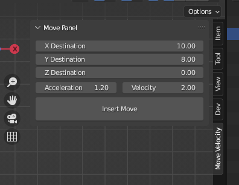

# bl_MoveVelocity
Simple path-planner utility to build object keyframes in Velocity-space in Blender

## Usage

1. Select an object in the Viewport
2. Add a destination position {X,Y} in the parameters
3. Configure an acceleration and maximum velocity parameter

'Insert Move' will:

1. Calculate the time necessary to complete the movement with the given dynamics parameters and convert this to a keyframe count
2. Insert the keyframes for the active object, starting at the current position, zero velocity, and current frame number.

## Installation

Install the Addon from Edit > Preferences > Addons

